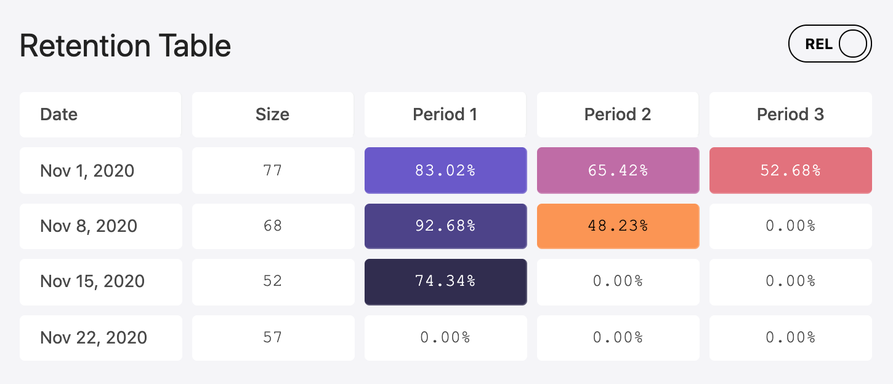

# Retention Matrix

User retention analysis for an e-commerce app.

Renders retention matrix to show how many users returned to an the app to place another order after their first order. 

### Data Set
An `Array` of user objects that contain a key `orders` that has an `Array` of all the orders placed by the user. 

```js
[
  {
    id: 1,
    name: 'User',
    /* ... */
    orders: [
      { id: 1, /* ... */ created_at: 1604188900}
      /* ...orders */
    ]
  }
  /* ...users */
]
```

Retention data will look like this:
```js
[
  {
    date_from: 'Nov 1, 2020',
    date_to: 'Nov 1, 2020',
    timestamp_from: 1604188800,
    timestamp_to: 1604189800,
    retention_abs: { 
      cohort_size: 20,
      cohort_group_1: 18,
      cohort_group_2: 14,
      /* cohort_group_n: x */
    },
  }
  /* ...cohorts */
]
```
Retention table will look like this:



## Building and running on localhost

First install dependencies:

```sh
npm install
```

To run in hot module reloading mode:

```sh
npm start
```

To create a production build:

```sh
npm run build-prod
```

## Running

```sh
node dist/bundle.js
```
